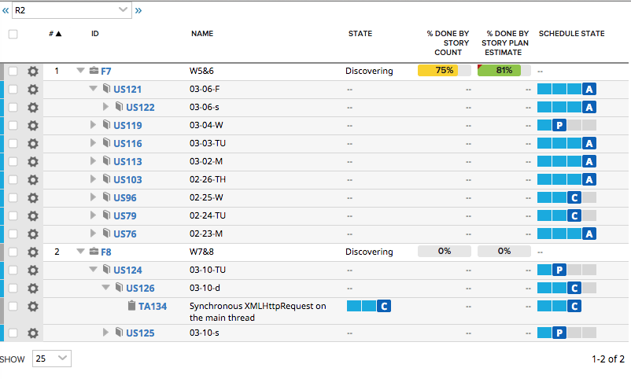

Feature Tree Grid
=========================

## Overview
This is a variation of [Filterable Tree Grid](https://help.rallydev.com/apps/2.0/doc/#!/example/filterable-tree-grid) example from AppSDK2 documentation.
It is modified to display PortfolioItem/Feature hierarchy, filtered by Release.

This app is vailable AS IS. It is NOT supported by Rally.

## License

AppTemplate is released under the MIT license.  See the file [LICENSE](./LICENSE) for the full text.

##Documentation for SDK

You can find the documentation on our help [site.](https://help.rallydev.com/apps/2.0/doc/)
